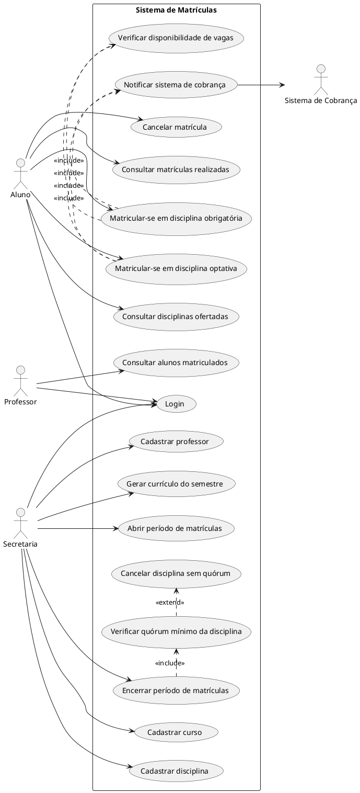

# Sistema de Matrículas — Universidade

## Sumário

- [Visão Geral](#visão-geral)
- [Diagrama de Casos de Uso](#diagrama-de-casos-de-uso)
- [Descrição dos Casos de Uso](#descrição-dos-casos-de-uso)
- [Histórias de Usuário](#histórias-de-usuário)

## Visão Geral

O sistema tem como objetivo informatizar o processo de matrícula de uma universidade, permitindo que
alunos se matriculem em disciplinas obrigatórias e optativas, que professores consultem suas turmas e
que a secretaria administre cursos, disciplinas e períodos de matrícula.

**Atores do sistema:**

| Ator | Descrição |
|---|---|
| Aluno | Realiza login, matricula-se e cancela matrículas em disciplinas |
| Professor | Realiza login e consulta os alunos matriculados em suas disciplinas |
| Secretaria | Cadastra cursos, disciplinas e professores; gera o currículo do semestre; controla o período de matrículas |
| Sistema de Cobrança | Ator externo/secundário, notificado automaticamente após uma matrícula |

## Diagrama de Casos de Uso

Código em PlantUML (pode ser renderizado em [plantuml.com](http://www.plantuml.com/plantuml/uml/) ou
via extensão do VS Code — recomendo exportar a imagem gerada e versionar no repositório em
`/docs/diagramas/`).

## Descrição dos Casos de Uso

| ID | Caso de Uso | Ator principal | Resumo |
|---|---|---|---|
| UC1 | Login | Todos | Validação de usuário e senha para acesso ao sistema |
| UC2 | Consultar disciplinas ofertadas | Aluno | Lista disciplinas do currículo do semestre com vagas disponíveis |
| UC3 | Matricular-se em disciplina obrigatória | Aluno | Aluno se matricula em até 4 disciplinas obrigatórias |
| UC4 | Matricular-se em disciplina optativa | Aluno | Aluno se matricula em até 2 disciplinas optativas |
| UC5 | Cancelar matrícula | Aluno | Aluno cancela matrícula feita durante o período vigente |
| UC6 | Consultar matrículas realizadas | Aluno | Aluno visualiza as disciplinas em que está matriculado |
| UC7 | Verificar disponibilidade de vagas | Sistema | Verifica se a disciplina não atingiu o limite de 60 alunos |
| UC8 | Notificar sistema de cobrança | Sistema | Envia notificação ao sistema de cobrança após confirmação de matrícula |
| UC9 | Cadastrar curso | Secretaria | Cadastra nome e número de créditos de um curso |
| UC10 | Cadastrar disciplina | Secretaria | Associa disciplina a um curso e a um professor |
| UC11 | Cadastrar professor | Secretaria | Cadastra dados e senha de acesso do professor |
| UC12 | Gerar currículo do semestre | Secretaria | Define o conjunto de disciplinas ofertadas no semestre |
| UC13 | Abrir período de matrículas | Secretaria | Define a janela de tempo em que alunos podem matricular/cancelar |
| UC14 | Encerrar período de matrículas | Secretaria | Fecha o período e dispara a verificação de quórum de cada disciplina |
| UC15 | Verificar quórum mínimo da disciplina | Sistema | Confere se a disciplina atingiu o mínimo de 3 alunos matriculados |
| UC16 | Cancelar disciplina sem quórum | Sistema | Cancela automaticamente disciplinas que não atingiram o mínimo de alunos |
| UC17 | Consultar alunos matriculados | Professor | Lista os alunos matriculados em uma disciplina do professor |
