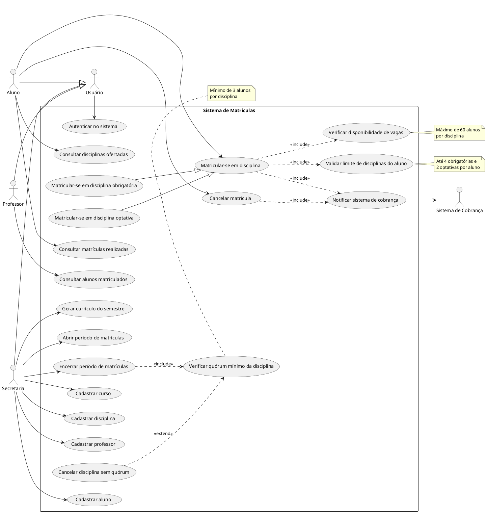

# Sistema de Matrículas — Universidade

## Sumário

- [Visão Geral](#visão-geral)
- [Diagrama de Casos de Uso](#diagrama-de-casos-de-uso)
- [Correções Aplicadas ao Diagrama de Casos de Uso](#correções-aplicadas-ao-diagrama-de-casos-de-uso)
- [Descrição dos Casos de Uso](#descrição-dos-casos-de-uso)
- [Histórias de Usuário](#histórias-de-usuário)

## Visão Geral

O sistema tem como objetivo informatizar o processo de matrícula de uma universidade, permitindo que
alunos se matriculem em disciplinas obrigatórias e optativas, que professores consultem suas turmas e
que a secretaria administre cursos, disciplinas e períodos de matrícula.

**Atores do sistema:**

| Ator | Descrição |
|---|---|
| Aluno | Realiza login, matricula-se e cancela matrículas em disciplinas |
| Professor | Realiza login e consulta os alunos matriculados em suas disciplinas |
| Secretaria | Cadastra cursos, disciplinas e professores; gera o currículo do semestre; controla o período de matrículas |
| Sistema de Cobrança | Ator externo/secundário, notificado automaticamente após uma matrícula |

## Diagrama de Casos de Uso

> A imagem acima corresponde à versão anterior do diagrama. A versão corrigida está em
> [`docs/diagramas/diagrama-casos-de-uso.puml`](docs/diagramas/diagrama-casos-de-uso.puml) e deve ser
> reexportada para substituir a imagem.

Código em PlantUML (pode ser renderizado em [plantuml.com](http://www.plantuml.com/plantuml/uml/) ou
via extensão do VS Code).

## Correções Aplicadas ao Diagrama de Casos de Uso

| # | Problema na versão anterior | Correção |
|---|---|---|
| 1 | O caso de uso *Login* estava ligado separadamente a Aluno, Professor e Secretaria, gerando três associações redundantes | Criado o ator abstrato **Usuário**, generalizado por Aluno, Professor e Secretaria; *Autenticar no sistema* passa a se associar apenas a ele |
| 2 | *Matricular-se em disciplina obrigatória* e *optativa* duplicavam as mesmas relações `<<include>>` | Criado o caso de uso base **Matricular-se em disciplina**, com as duas variantes ligadas por **generalização**; os `<<include>>` ficam só no caso base |
| 3 | O limite de 4 obrigatórias e 2 optativas não aparecia no diagrama, embora seja regra de negócio (HU03, HU04) | Incluído o caso de uso **Validar limite de disciplinas do aluno**, com `<<include>>` a partir da matrícula |
| 4 | *Cancelar matrícula* não notificava o sistema de cobrança, apesar de alterar o que o aluno deve pagar (HU08) | Adicionado `<<include>>` de *Cancelar matrícula* para *Notificar sistema de cobrança* |
| 5 | *Cadastrar aluno* não existia, mas o aluno precisa estar cadastrado para fazer login e se matricular | Incluído o caso de uso **Cadastrar aluno**, associado à Secretaria |
| 6 | As setas de `<<include>>`/`<<extend>>` usavam `.>` (linha tracejada curta), notação imprecisa | Padronizado para `..>`, a dependência tracejada da UML |
| 7 | As regras numéricas (60 vagas, 3 alunos, limites por aluno) ficavam só na descrição textual | Adicionadas como *notes* nos casos de uso correspondentes |

## Descrição dos Casos de Uso

| ID | Caso de Uso | Ator principal | Resumo | Classe responsável |
|---|---|---|---|---|
| UC1 | Autenticar no sistema | Usuário | Validação de login e senha para acesso ao sistema | `ServicoAutenticacao.autenticar` |
| UC2 | Consultar disciplinas ofertadas | Aluno | Lista disciplinas do currículo do semestre com vagas disponíveis | `ServicoMatricula.consultarDisciplinasOfertadas` |
| UC3 | Matricular-se em disciplina | Aluno | Caso base das matrículas; especializado em obrigatória (UC3A, até 4) e optativa (UC3B, até 2) | `ServicoMatricula.matricular` |
| UC4 | Cancelar matrícula | Aluno | Aluno cancela matrícula feita durante o período vigente | `ServicoMatricula.cancelarMatricula` |
| UC5 | Consultar matrículas realizadas | Aluno | Aluno visualiza as disciplinas em que está matriculado | `ServicoMatricula.consultarMatriculas` |
| UC6 | Verificar disponibilidade de vagas | Sistema | Verifica se a disciplina não atingiu o limite de 60 alunos | `Disciplina.temVagaDisponivel` |
| UC7 | Validar limite de disciplinas do aluno | Sistema | Verifica os limites de 4 obrigatórias e 2 optativas por aluno | `Aluno.podeSeMatricularEm` |
| UC8 | Notificar sistema de cobrança | Sistema | Notifica a cobrança após confirmação ou cancelamento de matrícula | `SistemaCobranca.notificarMatricula` |
| UC9 | Cadastrar curso | Secretaria | Cadastra nome e número de créditos de um curso | `ServicoSecretaria.cadastrarCurso` |
| UC10 | Cadastrar disciplina | Secretaria | Associa disciplina a um curso e a um professor | `ServicoSecretaria.cadastrarDisciplina` |
| UC11 | Cadastrar professor | Secretaria | Cadastra dados e senha de acesso do professor | `ServicoSecretaria.cadastrarProfessor` |
| UC12 | Cadastrar aluno | Secretaria | Cadastra o aluno e o vincula a um curso | `ServicoSecretaria.cadastrarAluno` |
| UC13 | Gerar currículo do semestre | Secretaria | Define o conjunto de disciplinas ofertadas no semestre | `ServicoSecretaria.gerarCurriculo` |
| UC14 | Abrir período de matrículas | Secretaria | Define a janela de tempo em que alunos podem matricular/cancelar | `ServicoSecretaria.abrirPeriodoMatriculas` |
| UC15 | Encerrar período de matrículas | Secretaria | Fecha o período e dispara a verificação de quórum de cada disciplina | `ServicoSecretaria.encerrarPeriodoMatriculas` |
| UC16 | Verificar quórum mínimo da disciplina | Sistema | Confere se a disciplina atingiu o mínimo de 3 alunos matriculados | `Disciplina.atingiuQuorumMinimo` |
| UC17 | Cancelar disciplina sem quórum | Sistema | Cancela automaticamente disciplinas que não atingiram o mínimo de alunos | `Disciplina.cancelarPorFaltaDeQuorum` |
| UC18 | Consultar alunos matriculados | Professor | Lista os alunos matriculados em uma disciplina do professor | `ServicoProfessor.consultarAlunosMatriculados` |

## Histórias de Usuário

Formato: *Como \<ator\>, eu quero \<ação\>, para que \<benefício\>.*

### Aluno

**HU01** — Como aluno, eu quero fazer login no sistema com meu usuário e senha, para que eu possa
acessar minhas informações de matrícula com segurança.

**HU02** — Como aluno, eu quero consultar as disciplinas ofertadas no semestre, para que eu possa
escolher em quais irei me matricular.

**HU03** — Como aluno, eu quero me matricular em até 4 disciplinas obrigatórias, para que eu cumpra
o currículo do meu curso no semestre.

**HU04** — Como aluno, eu quero me matricular em até 2 disciplinas optativas, para que eu complemente
minha formação com temas de meu interesse.

**HU05** — Como aluno, eu quero ser impedido de me matricular em uma disciplina que já atingiu 60
alunos, para que eu saiba que preciso escolher outra opção.

**HU06** — Como aluno, eu quero cancelar uma matrícula feita durante o período de matrículas, para que
eu possa corrigir minha escolha de disciplinas.

**HU07** — Como aluno, eu quero consultar as disciplinas em que estou matriculado, para que eu
acompanhe minha situação acadêmica no semestre.

**HU08** — Como aluno, eu quero que o sistema de cobrança seja notificado automaticamente após minha
matrícula, para que eu seja cobrado corretamente pelas disciplinas cursadas.

### Professor

**HU09** — Como professor, eu quero fazer login no sistema com meu usuário e senha, para que eu
acesse apenas as informações das minhas disciplinas.

**HU10** — Como professor, eu quero consultar a lista de alunos matriculados em cada uma das minhas
disciplinas, para que eu possa me preparar para o início do semestre.

### Secretaria

**HU11** — Como secretaria, eu quero cadastrar cursos com nome e número de créditos, para que os
alunos possam ser vinculados a um curso válido.

**HU12** — Como secretaria, eu quero cadastrar disciplinas associadas a um curso e a um professor,
para que elas possam compor o currículo do semestre.

**HU13** — Como secretaria, eu quero cadastrar professores no sistema, para que eles possam acessar
suas turmas.

**HU14** — Como secretaria, eu quero gerar o currículo de disciplinas de cada semestre, para que os
alunos saibam quais disciplinas estarão disponíveis para matrícula.

**HU15** — Como secretaria, eu quero definir o período de matrículas, para que alunos só possam
matricular ou cancelar disciplinas dentro da janela permitida.

**HU16** — Como secretaria, eu quero que o sistema verifique automaticamente, ao final do período de
matrículas, se cada disciplina atingiu o mínimo de 3 alunos, para que disciplinas sem quórum sejam
canceladas automaticamente.

**HU17** — Como secretaria, quero encerrar o período de matrículas, para que o sistema dispare a verificação de quórum das disciplinas

---
