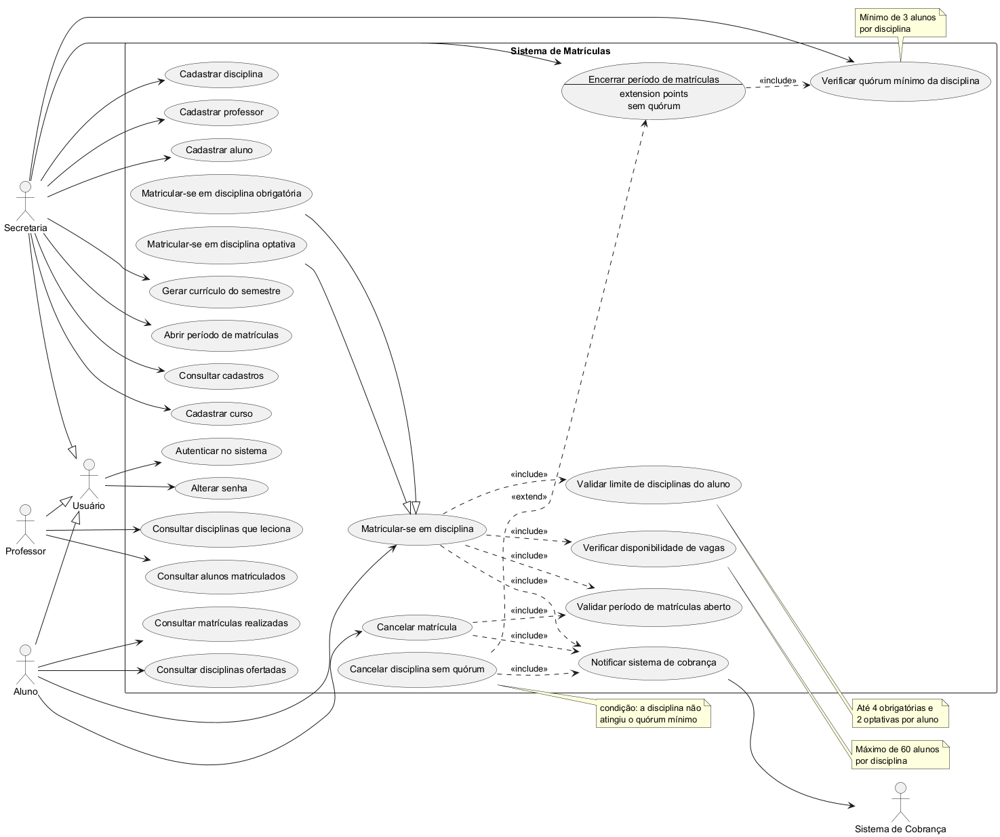

# Sistema de Matrículas — Universidade

## Sumário

- [Visão Geral](#visão-geral)
- [Diagrama de Casos de Uso](#diagrama-de-casos-de-uso)
- [Correções Aplicadas ao Diagrama de Casos de Uso](#correções-aplicadas-ao-diagrama-de-casos-de-uso)
- [Descrição dos Casos de Uso](#descrição-dos-casos-de-uso)
- [Histórias de Usuário](#histórias-de-usuário)
- [Diagrama de Classes](#diagrama-de-classes)
- [Regras de Negócio no Modelo](#regras-de-negócio-no-modelo)
- [Protótipo (Lab01S03)](#protótipo-lab01s03)

## Visão Geral

O sistema tem como objetivo informatizar o processo de matrícula de uma universidade, permitindo que
alunos se matriculem em disciplinas obrigatórias e optativas, que professores consultem suas turmas e
que a secretaria administre cursos, disciplinas e períodos de matrícula.

**Atores do sistema:**

| Ator | Descrição |
|---|---|
| Aluno | Realiza login, matricula-se e cancela matrículas em disciplinas |
| Professor | Realiza login e consulta os alunos matriculados em suas disciplinas |
| Secretaria | Cadastra cursos, disciplinas e professores; gera o currículo do semestre; controla o período de matrículas |
| Sistema de Cobrança | Ator externo/secundário, notificado automaticamente após uma matrícula |

## Diagrama de Casos de Uso



Fonte PlantUML: [`docs/diagramas/diagrama-casos-de-uso.puml`](docs/diagramas/diagrama-casos-de-uso.puml)
(pode ser renderizado em [plantuml.com](http://www.plantuml.com/plantuml/uml/) ou pela extensão do
VS Code). As imagens de `docs/diagramas/` são exportadas a partir desses arquivos.

## Correções Aplicadas ao Diagrama de Casos de Uso

| # | Problema na versão anterior | Correção |
|---|---|---|
| 1 | O caso de uso *Login* estava ligado separadamente a Aluno, Professor e Secretaria, gerando três associações redundantes | Criado o ator abstrato **Usuário**, generalizado por Aluno, Professor e Secretaria; *Autenticar no sistema* passa a se associar apenas a ele |
| 2 | *Matricular-se em disciplina obrigatória* e *optativa* duplicavam as mesmas relações `<<include>>` | Criado o caso de uso base **Matricular-se em disciplina**, com as duas variantes ligadas por **generalização**; os `<<include>>` ficam só no caso base |
| 3 | O limite de 4 obrigatórias e 2 optativas não aparecia no diagrama, embora seja regra de negócio (HU03, HU04) | Incluído o caso de uso **Validar limite de disciplinas do aluno**, com `<<include>>` a partir da matrícula |
| 4 | *Cancelar matrícula* não notificava o sistema de cobrança, apesar de alterar o que o aluno deve pagar (HU08) | Adicionado `<<include>>` de *Cancelar matrícula* para *Notificar sistema de cobrança* |
| 5 | *Cadastrar aluno* não existia, mas o aluno precisa estar cadastrado para fazer login e se matricular | Incluído o caso de uso **Cadastrar aluno**, associado à Secretaria |
| 6 | As setas de `<<include>>`/`<<extend>>` usavam `.>` (linha tracejada curta), notação imprecisa | Padronizado para `..>`, a dependência tracejada da UML |
| 7 | As regras numéricas (60 vagas, 3 alunos, limites por aluno) ficavam só na descrição textual | Adicionadas como *notes* nos casos de uso correspondentes |

### Correções da Lab01S03

| # | Problema na versão anterior | Correção |
|---|---|---|
| 8 | *Cancelar disciplina sem quórum* estendia *Verificar quórum*, que é um caso incluído, e não um caso base com ponto de extensão | Passa a estender **Encerrar período de matrículas**, que declara o ponto de extensão *sem quórum*; a condição fica em uma *note* |
| 9 | O cancelamento de disciplina sem quórum cancela as matrículas, mas não avisava a cobrança | Adicionado `<<include>>` de *Cancelar disciplina sem quórum* para *Notificar sistema de cobrança* |
| 10 | A exigência de período aberto para matricular e cancelar (HU06, HU15) não aparecia no diagrama | Incluído **Validar período de matrículas aberto** (UC21), com `<<include>>` a partir de matrícula e cancelamento |
| 11 | O professor só consultava alunos de uma disciplina, mas não tinha como ver quais disciplinas leciona | Incluído **Consultar disciplinas que leciona** (UC20) |
| 12 | Não havia como o usuário trocar a senha inicial definida pela secretaria | Incluído **Alterar senha** (UC19), associado ao ator Usuário |
| 13 | A secretaria não tinha como consultar o que cadastrou (cursos, professores, alunos, disciplinas, currículos) | Incluído **Consultar cadastros** (UC22); a secretaria também passa a acionar diretamente *Verificar quórum* para acompanhar as turmas antes do encerramento |

## Descrição dos Casos de Uso

| ID | Caso de Uso | Ator principal | Resumo | Classe responsável |
|---|---|---|---|---|
| UC1 | Autenticar no sistema | Usuário | Validação de login e senha para acesso ao sistema | `ServicoAutenticacao.autenticar` |
| UC2 | Consultar disciplinas ofertadas | Aluno | Lista disciplinas do currículo do semestre com vagas disponíveis | `ServicoMatricula.consultarDisciplinasOfertadas` |
| UC3 | Matricular-se em disciplina | Aluno | Caso base das matrículas; especializado em obrigatória (UC3A, até 4) e optativa (UC3B, até 2) | `ServicoMatricula.matricular` |
| UC4 | Cancelar matrícula | Aluno | Aluno cancela matrícula feita durante o período vigente | `ServicoMatricula.cancelarMatricula` |
| UC5 | Consultar matrículas realizadas | Aluno | Aluno visualiza as disciplinas em que está matriculado | `ServicoMatricula.consultarMatriculas` |
| UC6 | Verificar disponibilidade de vagas | Sistema | Verifica se a disciplina não atingiu o limite de 60 alunos | `Disciplina.temVagaDisponivel` |
| UC7 | Validar limite de disciplinas do aluno | Sistema | Verifica os limites de 4 obrigatórias e 2 optativas por aluno | `Aluno.podeSeMatricularEm` |
| UC8 | Notificar sistema de cobrança | Sistema | Notifica a cobrança após confirmação ou cancelamento de matrícula | `SistemaCobranca.notificarMatricula` / `notificarCancelamento` |
| UC9 | Cadastrar curso | Secretaria | Cadastra nome e número de créditos de um curso | `ServicoSecretaria.cadastrarCurso` |
| UC10 | Cadastrar disciplina | Secretaria | Associa disciplina a um curso e a um professor | `ServicoSecretaria.cadastrarDisciplina` |
| UC11 | Cadastrar professor | Secretaria | Cadastra dados e senha de acesso do professor | `ServicoSecretaria.cadastrarProfessor` |
| UC12 | Cadastrar aluno | Secretaria | Cadastra o aluno e o vincula a um curso | `ServicoSecretaria.cadastrarAluno` |
| UC13 | Gerar currículo do semestre | Secretaria | Define o conjunto de disciplinas ofertadas no semestre | `ServicoSecretaria.gerarCurriculo` |
| UC14 | Abrir período de matrículas | Secretaria | Define a janela de tempo em que alunos podem matricular/cancelar | `ServicoSecretaria.abrirPeriodoMatriculas` |
| UC15 | Encerrar período de matrículas | Secretaria | Fecha o período e dispara a verificação de quórum de cada disciplina | `ServicoSecretaria.encerrarPeriodoMatriculas` |
| UC16 | Verificar quórum mínimo da disciplina | Secretaria / Sistema | Confere se a disciplina atingiu o mínimo de 3 alunos matriculados | `ServicoSecretaria.verificarQuoruns`, `Disciplina.atingiuQuorumMinimo` |
| UC17 | Cancelar disciplina sem quórum | Sistema | Estende o encerramento: cancela a disciplina e suas matrículas, notificando a cobrança | `Disciplina.cancelarPorFaltaDeQuorum` |
| UC18 | Consultar alunos matriculados | Professor | Lista os alunos matriculados em uma disciplina do professor | `ServicoProfessor.consultarAlunosMatriculados` |
| UC19 | Alterar senha | Usuário | Troca a senha informando a senha atual | `ServicoAutenticacao.alterarSenha` |
| UC20 | Consultar disciplinas que leciona | Professor | Lista as disciplinas do professor com situação e número de matriculados | `ServicoProfessor.consultarDisciplinas` |
| UC21 | Validar período de matrículas aberto | Sistema | Garante que matrícula e cancelamento ocorram só dentro do período vigente | `ServicoMatricula.validarPeriodoAberto` |
| UC22 | Consultar cadastros | Secretaria | Lista cursos, professores, alunos, disciplinas, currículos e períodos | `cli.MenuConsultas` |

## Histórias de Usuário

Formato: *Como \<ator\>, eu quero \<ação\>, para que \<benefício\>.*

### Aluno

**HU01** — Como aluno, eu quero fazer login no sistema com meu usuário e senha, para que eu possa
acessar minhas informações de matrícula com segurança.

**HU02** — Como aluno, eu quero consultar as disciplinas ofertadas no semestre, para que eu possa
escolher em quais irei me matricular.

**HU03** — Como aluno, eu quero me matricular em até 4 disciplinas obrigatórias, para que eu cumpra
o currículo do meu curso no semestre.

**HU04** — Como aluno, eu quero me matricular em até 2 disciplinas optativas, para que eu complemente
minha formação com temas de meu interesse.

**HU05** — Como aluno, eu quero ser impedido de me matricular em uma disciplina que já atingiu 60
alunos, para que eu saiba que preciso escolher outra opção.

**HU06** — Como aluno, eu quero cancelar uma matrícula feita durante o período de matrículas, para que
eu possa corrigir minha escolha de disciplinas.

**HU07** — Como aluno, eu quero consultar as disciplinas em que estou matriculado, para que eu
acompanhe minha situação acadêmica no semestre.

**HU08** — Como aluno, eu quero que o sistema de cobrança seja notificado automaticamente após minha
matrícula, para que eu seja cobrado corretamente pelas disciplinas cursadas.

### Professor

**HU09** — Como professor, eu quero fazer login no sistema com meu usuário e senha, para que eu
acesse apenas as informações das minhas disciplinas.

**HU10** — Como professor, eu quero consultar a lista de alunos matriculados em cada uma das minhas
disciplinas, para que eu possa me preparar para o início do semestre.

### Secretaria

**HU11** — Como secretaria, eu quero cadastrar cursos com nome e número de créditos, para que os
alunos possam ser vinculados a um curso válido.

**HU12** — Como secretaria, eu quero cadastrar disciplinas associadas a um curso e a um professor,
para que elas possam compor o currículo do semestre.

**HU13** — Como secretaria, eu quero cadastrar professores no sistema, para que eles possam acessar
suas turmas.

**HU14** — Como secretaria, eu quero gerar o currículo de disciplinas de cada semestre, para que os
alunos saibam quais disciplinas estarão disponíveis para matrícula.

**HU15** — Como secretaria, eu quero definir o período de matrículas, para que alunos só possam
matricular ou cancelar disciplinas dentro da janela permitida.

**HU16** — Como secretaria, eu quero que o sistema verifique automaticamente, ao final do período de
matrículas, se cada disciplina atingiu o mínimo de 3 alunos, para que disciplinas sem quórum sejam
canceladas automaticamente.

**HU17** — Como secretaria, quero encerrar o período de matrículas, para que o sistema dispare a verificação de quórum das disciplinas

## Diagrama de Classes

O diagrama foi dividido em dois para continuar legível:

- **Domínio, serviços, repositórios, integração e exceções** —
  [`diagrama-classes.puml`](docs/diagramas/diagrama-classes.puml) ·
  [imagem](docs/diagramas/DiagramaClasses.png)
- **Protótipo: persistência em arquivos e interface de linha de comando** —
  [`diagrama-classes-prototipo.puml`](docs/diagramas/diagrama-classes-prototipo.puml) ·
  [imagem](docs/diagramas/DiagramaClassesPrototipo.png)

### Correções da Lab01S03

| # | Problema na versão anterior | Correção |
|---|---|---|
| 1 | `Disciplina "1" -- "3..60" Matricula`: durante o período uma disciplina pode ter 0, 1 ou 2 alunos; o quórum só é exigido no encerramento | Multiplicidade `*`; os limites (máx. 60 ativas, mín. 3 para confirmar) ficam em uma *note* |
| 2 | `Aluno "1" -- "0..6" Matricula`: matrículas canceladas permanecem como histórico, então um aluno pode ter mais de 6 objetos `Matricula` | Multiplicidade `*`; o limite de 4 + 2 vale para matrículas **ativas** (*note*) |
| 3 | `Curriculo "1" o-- "*" Disciplina` impedia uma disciplina de constar em mais de um currículo, e permitia currículo vazio | `Curriculo "*" o-- "1..*" Disciplina` |
| 4 | `MatriculaException <<RuntimeException>>` usava estereótipo para representar herança | Generalização `RuntimeException <\|-- MatriculaException` |
| 5 | `ServicoSecretaria` cancela matrículas no encerramento, mas não dependia de `RepositorioMatricula` nem de `SistemaCobranca` | Dependências adicionadas; `encerrarPeriodoMatriculas` retorna as disciplinas canceladas |
| 6 | `Usuario.senha` sugeria senha em texto puro | Atributo `hashSenha` (SHA-256) |
| 7 | Métodos necessários à implementação não estavam modelados | Adicionados `Disciplina.abrirParaMatricula`, `Aluno.buscarMatriculaAtiva`, `Professor.adicionarDisciplina`, `ServicoAutenticacao.alterarSenha`, `RepositorioUsuario.buscarPorPerfil`, `CadastroInvalidoException` |
| 8 | Não havia camada de persistência nem de interface | Pacotes `persistencia` e `cli` no diagrama do protótipo |

### Pacote `modelo` — entidades do domínio

| Classe | Responsabilidade | Principais atributos |
|---|---|---|
| `Usuario` *(abstrata)* | Base de autenticação de todos os perfis | `id`, `nome`, `login`, `hashSenha` |
| `Aluno` | Matricula-se e cancela matrículas | `matricula`, `curso`, `matriculas` |
| `Professor` | Consulta suas disciplinas e alunos | `siape`, `departamento`, `disciplinas` |
| `Secretaria` | Perfil administrativo | `setor` |
| `Curso` | Curso de graduação | `codigo`, `nome`, `creditos`, `disciplinas` |
| `Disciplina` | Disciplina ofertada, com controle de vagas e quórum | `codigo`, `nome`, `creditos`, `tipo`, `status`, `professor`, `matriculas` |
| `Matricula` | Classe associativa entre `Aluno` e `Disciplina` | `dataMatricula`, `dataCancelamento`, `status` |
| `Curriculo` | Disciplinas ofertadas por um curso num semestre | `semestre`, `curso`, `disciplinas` |
| `PeriodoMatricula` | Janela em que matrículas são permitidas | `semestre`, `dataInicio`, `dataFim`, `aberto` |
| `TipoDisciplina` *(enum)* | `OBRIGATORIA(4)`, `OPTATIVA(2)` — carrega o limite por aluno | `limitePorAluno` |
| `StatusDisciplina` *(enum)* | `PLANEJADA`, `ABERTA`, `CONFIRMADA`, `CANCELADA` | — |
| `StatusMatricula` *(enum)* | `ATIVA`, `CANCELADA` | — |

### Demais pacotes

| Pacote | Conteúdo |
|---|---|
| `servico` | `ServicoAutenticacao`, `ServicoMatricula`, `ServicoSecretaria`, `ServicoProfessor` — orquestram os casos de uso |
| `repositorio` | `Repositorio<T, ID>` e as interfaces específicas de cada entidade |
| `integracao` | `SistemaCobranca` (porta para o ator externo) e `SistemaCobrancaAdapter`, que grava a remessa em arquivo |
| `excecao` | `MatriculaException` e as exceções de regra de negócio derivadas dela |
| `persistencia` | `RepositorioArquivo<T>` e as implementações dos repositórios em arquivo texto |
| `cli` | `TelaInicial`, `Menu` e os menus de aluno, professor e secretaria |

### Relacionamentos e multiplicidades

| Relacionamento | Multiplicidade | Observação |
|---|---|---|
| `Aluno` — `Matricula` | 1 para * | Até 4 obrigatórias + 2 optativas **ativas**; canceladas ficam no histórico |
| `Disciplina` — `Matricula` | 1 para * | Até 60 **ativas**; mínimo de 3 para ser confirmada no encerramento |
| `Aluno` — `Curso` | * para 1 | Aluno pertence a um curso |
| `Curso` — `Disciplina` | 1 para * | Agregação |
| `Professor` — `Disciplina` | 1 para * | Professor responsável |
| `Curriculo` — `Disciplina` | * para 1..* | Agregação das disciplinas do semestre |
| `Usuario` → `Aluno`/`Professor`/`Secretaria` | herança | Generalização dos perfis |

## Regras de Negócio no Modelo

| Regra | Onde está representada |
|---|---|
| Máximo de 60 alunos por disciplina | `Disciplina.MAXIMO_ALUNOS` e `Disciplina.temVagaDisponivel()` |
| Mínimo de 3 alunos por disciplina | `Disciplina.MINIMO_ALUNOS` e `Disciplina.atingiuQuorumMinimo()` |
| Até 4 disciplinas obrigatórias por aluno | `TipoDisciplina.OBRIGATORIA.getLimitePorAluno()` |
| Até 2 disciplinas optativas por aluno | `TipoDisciplina.OPTATIVA.getLimitePorAluno()` |
| Matrícula só dentro do período vigente | `PeriodoMatricula.estaAberto()` e `ServicoMatricula.validarPeriodoAberto()` |
| Cancelamento automático sem quórum | `Disciplina.cancelarPorFaltaDeQuorum()`, disparado por `ServicoSecretaria.encerrarPeriodoMatriculas()` |
| Notificação da cobrança após matrícula e cancelamento | `SistemaCobranca.notificarMatricula()` / `notificarCancelamento()` |
| Matrícula só em disciplina do currículo do curso do aluno | `ServicoMatricula.validarOferta()` |
| Sem matrícula duplicada na mesma disciplina | `Aluno.estaMatriculadoEm()` → `MatriculaDuplicadaException` |

## Protótipo (Lab01S03)

Protótipo funcional em Java 17 com **interface em linha de comando** e **persistência em arquivos
texto**. Todas as funcionalidades dos casos de uso estão utilizáveis pelos menus de cada perfil.

### Como executar

Requisito: JDK 17 ou superior instalado (`java -version`).

Com Maven:

```bash
mvn compile
mvn exec:java -Dexec.mainClass=matriculas.Aplicacao
mvn test
```

Sem Maven instalado, em Linux/macOS ou Git Bash:

```bash
javac -encoding UTF-8 -d target/classes $(find src/main/java -name '*.java')
java -cp target/classes matriculas.Aplicacao
```

Sem Maven instalado, no PowerShell (o `$(find ...)` do Bash não funciona nele):

```powershell
javac -encoding UTF-8 -d target/classes (Get-ChildItem -Recurse -Path src/main/java -Filter *.java).FullName
java -cp target/classes matriculas.Aplicacao
```

Os dados são gravados na pasta `dados/` do diretório de execução. Outra pasta pode ser informada
como argumento (`java -cp target/classes matriculas.Aplicacao outra-pasta`). Para recomeçar do zero,
basta apagar a pasta.

#### Acentos corrompidos no terminal (Windows)

No Windows, dois problemas de codificação se somam e precisam ser corrigidos juntos:

1. O **console do Windows** (usado até por terminais integrados como o do VS Code, inclusive com Git
   Bash) normalmente não usa UTF-8 por padrão, mesmo em sessões novas. Se o *codepage* ativo não for
   UTF-8 (65001), cada caractere acentuado (2 bytes em UTF-8) aparece como dois glifos errados — por
   exemplo, `Matr\xC3\xADculas` em vez de `Matrículas`.
2. O **Java** usa por padrão a codificação ANSI do sistema (`Cp1252`) para a entrada e saída padrão,
   independente do *codepage* do console, o que também corrompe os acentos (aparecem como `?` ou `�`).

Corrija os dois, nessa ordem, uma vez por sessão do terminal, antes de executar o sistema:

PowerShell:

```powershell
chcp 65001
$env:JDK_JAVA_OPTIONS = "-Dstdout.encoding=UTF-8 -Dstderr.encoding=UTF-8 -Dstdin.encoding=UTF-8"
```

cmd.exe:

```cmd
chcp 65001
set JDK_JAVA_OPTIONS=-Dstdout.encoding=UTF-8 -Dstderr.encoding=UTF-8 -Dstdin.encoding=UTF-8
```

bash / Git Bash (inclusive o terminal integrado do VS Code):

```bash
chcp.com 65001
export JDK_JAVA_OPTIONS="-Dstdout.encoding=UTF-8 -Dstderr.encoding=UTF-8 -Dstdin.encoding=UTF-8"
```

Depois disso, tanto `mvn exec:java` quanto `java -cp target/classes matriculas.Aplicacao` exibem os
acentos corretamente. A mensagem `NOTE: Picked up JDK_JAVA_OPTIONS...`, exibida uma vez no início, é
apenas informativa e pode ser ignorada. Se abrir uma nova aba/janela de terminal, repita os dois
comandos nela.

### Dados de exemplo e usuários

Na primeira execução (pasta de dados vazia) o sistema grava dados de exemplo: os cursos ES e CC,
10 disciplinas, o currículo de **2026/2**, o período de matrículas aberto (de 7 dias atrás até daqui
a 30 dias) e algumas matrículas.

| Perfil | Login | Senha | Observação |
|---|---|---|---|
| Secretaria | `admin` | `admin` | Acesso a cadastros, currículo e período |
| Professor | `joao`, `maria`, `paulo` | `123` | João leciona ES101, ES105, ES201 e CC101 |
| Aluno | `ana` | `123` | Engenharia de Software; já matriculada em ES101, ES104 e ES201 |
| Aluno | `bruno`, `carla`, `diego` | `123` | Engenharia de Software (bruno e carla já em ES101) |
| Aluno | `elisa` | `123` | Ciência da Computação |

### Funcionalidades por perfil

| Perfil | Menu | Caso de uso |
|---|---|---|
| Todos | Entrar / Sair (logout) / Alterar senha | UC1, UC19 |
| Aluno | Consultar disciplinas ofertadas (com vagas restantes) | UC2 |
| Aluno | Matricular-se em disciplina | UC3, UC6, UC7, UC8, UC21 |
| Aluno | Cancelar matrícula | UC4, UC8, UC21 |
| Aluno | Consultar minhas matrículas (inclui canceladas) | UC5 |
| Professor | Consultar minhas disciplinas | UC20 |
| Professor | Consultar alunos matriculados | UC18 |
| Secretaria | Cadastrar curso, professor, aluno e disciplina | UC9–UC12 |
| Secretaria | Gerar currículo do semestre | UC13 |
| Secretaria | Abrir / encerrar período de matrículas | UC14, UC15, UC17 |
| Secretaria | Verificar quórum das disciplinas | UC16 |
| Secretaria | Consultar cadastros (cursos, professores, alunos, disciplinas, currículos, períodos) | UC22 |

Violações de regra (limite de disciplinas, turma lotada, período fechado, matrícula duplicada etc.)
são exibidas como `[ERRO] mensagem` e o menu continua disponível.

### Roteiro sugerido de demonstração

1. Entre como `ana` e tente se matricular em mais duas obrigatórias (ex.: ES102 e ES103) e depois em
   ES105: a terceira é recusada pelo limite de 4 obrigatórias.
2. Cancele uma matrícula e consulte "minhas matrículas": a cancelada aparece com data de cancelamento.
3. Entre como `joao` e consulte os alunos de ES101.
4. Entre como `admin`, use "Verificar quórum" e depois "Encerrar período": ES101 (3 alunos) é
   confirmada e as disciplinas com menos de 3 alunos são canceladas, junto com suas matrículas.
5. Feche e abra o programa novamente: todos os dados continuam lá. O arquivo `dados/cobranca.txt`
   mostra as notificações enviadas ao sistema de cobrança.

### Persistência em arquivos

Cada repositório (`persistencia.Repositorio*Arquivo`) mantém as entidades em memória e regrava seu
arquivo a cada alteração, uma entidade por linha, campos separados por `;` (caracteres especiais são
escapados com `\`). As referências entre entidades são gravadas pelo id e resolvidas na carga, na
ordem cursos → usuários → disciplinas → currículos → períodos → matrículas.

| Arquivo | Conteúdo (campos) |
|---|---|
| `cursos.txt` | id; código; nome; créditos |
| `usuarios.txt` | id; perfil; nome; login; hash SHA-256 da senha; matrícula/SIAPE/setor; curso/departamento |
| `disciplinas.txt` | id; código; nome; créditos; tipo; situação; id do curso; id do professor |
| `curriculos.txt` | id; semestre; id do curso; ids das disciplinas |
| `periodos.txt` | id; semestre; início; fim; aberto |
| `matriculas.txt` | id; id do aluno; id da disciplina; data da matrícula; data do cancelamento; situação |
| `cobranca.txt` | remessa ao sistema de cobrança: data/hora; MATRICULA ou CANCELAMENTO; aluno; disciplina; créditos |

### Estrutura

```
sistema-matriculas/
├── pom.xml
├── docs/diagramas/                 fontes .puml e imagens exportadas
├── src/main/java/matriculas/
│   ├── Aplicacao.java              ponto de entrada: monta repositórios, serviços e a CLI
│   ├── DadosIniciais.java          dados de exemplo da primeira execução
│   ├── modelo/                     entidades e regras de negócio
│   ├── servico/                    casos de uso
│   ├── repositorio/                interfaces dos repositórios
│   ├── persistencia/               repositórios em arquivo texto
│   ├── integracao/                 sistema de cobrança (remessa em arquivo)
│   ├── excecao/                    exceções de regra de negócio
│   └── cli/                        telas e menus da linha de comando
└── src/test/java/matriculas/       testes JUnit 5 das regras e da persistência
```

### Testes

`SistemaMatriculasTest` (JUnit 5) cobre autenticação, limites de 4 obrigatórias e 2 optativas,
matrícula duplicada, limite de 60 vagas, oferta restrita ao currículo do curso, cancelamento com
notificação à cobrança, encerramento do período com confirmação/cancelamento por quórum, acesso do
professor apenas às suas turmas e a recarga completa dos dados a partir dos arquivos.

### Limitações do protótipo

- Uma disciplina tem uma única oferta: após confirmada ou cancelada, não volta a ser ofertada.
- Os limites por aluno contam as matrículas ativas; não há separação por semestre.
- O sistema de cobrança é simulado por um arquivo de remessa.
